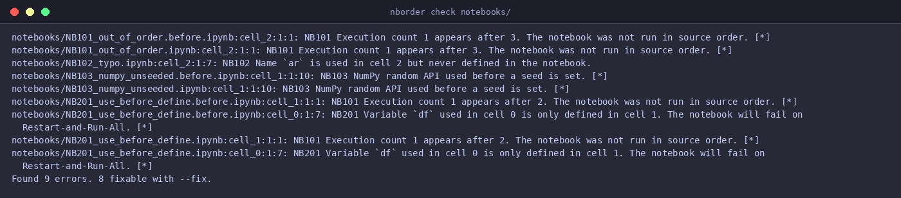
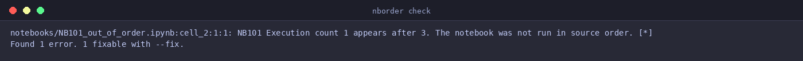
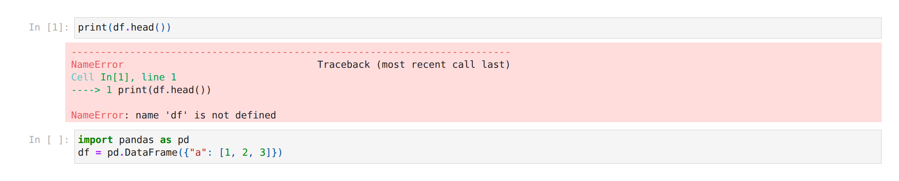
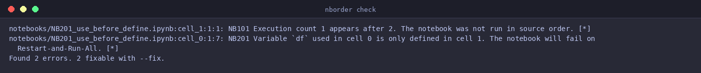
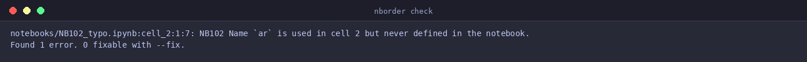
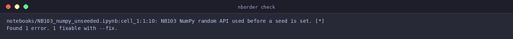
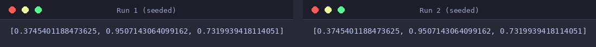
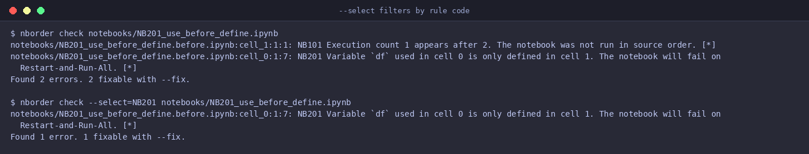
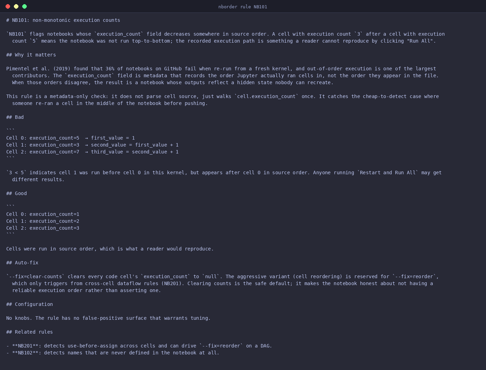

# nborder

A fast, opinionated linter and auto-fixer for Jupyter notebook hidden-state and execution-order bugs.



[](https://pypi.org/project/nborder/)
[](https://github.com/moonrunnerkc/nborder/actions/workflows/ci.yml)
[](https://pypi.org/project/nborder/)
[](LICENSE)

## What this catches

| Code  | Name                                | One-line example |
|-------|-------------------------------------|------------------|
| NB101 | Non-monotonic execution counts      | Cell 1 ran with `In [3]:` after cell 0 ran with `In [5]:`. |
| NB102 | Won't survive Restart-and-Run-All   | `print(df)` references a name no cell in the notebook defines. |
| NB201 | Use-before-assign across cells      | Cell 0 uses `df`; `df = ...` only appears in cell 1. |
| NB103 | Stochastic library used without seed | `np.random.rand(3)` runs with no seed call before it. |

Each rule has a docs page under [`docs/rules/`](docs/rules/) explaining the bug class, a bad and good example, and the auto-fix behaviour. The four sections below walk through each rule with the diagnostic nborder actually emits.

### NB101: out-of-order execution

The `execution_count` field on each cell records the order Jupyter actually ran cells in, not the order they appear in the file. When those orders disagree, the recorded outputs reflect a hidden state nobody can recreate. NB101 walks the counts once and fires when they decrease.



`--fix=clear-counts` resets every `execution_count` to `null` so subsequent runs cannot disagree with the source order.

### NB201: use before define

Variables used in cell N but only defined in some later cell N+k. The notebook works in the user's live kernel because the later cell was run first; on Restart-and-Run-All it raises `NameError`. This is the failure mode that hides during interactive authoring and surfaces in CI or for the first reviewer.



`--fix=reorder` topologically sorts the cells when the dependency graph is a DAG. After the fix the same Restart-and-Run-All executes cleanly.



### NB102: undefined name

A name used somewhere in the notebook is never defined by any cell. The kernel works in interactive use because the user happened to define the name from a deleted cell; from a fresh kernel, `NameError` fires. NB102 has no auto-fix in 0.1.x because there is no general way to guess the intended name; the user fixes it by hand.



### NB103: unseeded stochastic call

Stochastic library APIs that run before any seed call. Reruns produce different numbers, downstream metrics drift, and reviewers cannot reproduce the notebook's claimed results. The 0.1.4 numpy injection seeds both the legacy global `RandomState` and the modern Generator API in two lines, so reruns of a fixed notebook are byte-identical regardless of which API the user actually calls.



After `--fix`, two `nbconvert --execute` runs produce identical floats:



## Quick start

```bash
pip install nborder
nborder check notebook.ipynb
nborder check --fix notebook.ipynb
nborder check --output-format=json notebook.ipynb
```

The `--fix` flag reorders cells topologically when the dependency graph is a DAG, injects library-appropriate seed calls for stochastic libraries, and clears execution counts when they no longer reflect a reproducible run order. Every fix is a pipeline stage with a `bailed` outcome that does not block other fixes; running the same fix twice is a byte-stable no-op.

## Pre-commit

Add this to your `.pre-commit-config.yaml`:

```yaml
repos:
  - repo: https://github.com/moonrunnerkc/nborder
    rev: v0.1.4
    hooks:
      - id: nborder
```

Then `pre-commit install`. Full setup notes in [`docs/integrations/pre-commit.md`](docs/integrations/pre-commit.md).

## GitHub Actions

```yaml
- uses: moonrunnerkc/nborder@v0.1.4
  with:
    path: notebooks/
```

Diagnostics show up as inline annotations on the PR. Full options in [`docs/integrations/github-actions.md`](docs/integrations/github-actions.md).

## Configuration

`nborder` reads its configuration from `[tool.nborder]` in `pyproject.toml`:

```toml
[tool.nborder.seeds]
value = 42
libraries = ["numpy", "torch", "tensorflow", "random"]
```

Run `nborder config` to print the effective merged configuration.

### Filtering rules with --select

`--select=<CODES>` keeps only the listed rule codes in the diagnostic output. Useful for adopting a subset of rules, scoping a fix-up commit, or running a single rule in CI. Unknown codes exit 2 with a clear error.



## Rule documentation

`nborder rule <CODE>` prints the rule's full documentation from the installed wheel. Useful when triaging a finding without leaving the terminal.



## FAQ

**Why not use ruff?** Ruff lints Python source, not notebook structure. It does not see cross-cell dataflow, so it cannot detect that `df` is used in cell 0 and only defined in cell 1. nborder is purpose-built for the cross-cell story; it is complementary to ruff, not competitive.

**How is this different from nbqa?** `nbqa` runs Python linters against notebook cells one at a time. nborder builds a cross-cell symbol dependency graph and reasons about the relationships between cells, which is the part nbqa explicitly does not do.

**Does it work with R or Julia notebooks?** Not in v0.1. Multi-language support is reserved for a future release. Python kernels cover roughly 95% of notebooks in the wild.

**Will it modify my notebook outputs?** No. Outputs, cell metadata, and notebook-level metadata are read-only. The only fix that touches `execution_count` is a clear-to-null operation that runs as part of the reorder fix.

**What about magics?** `%line`, `%%cell`, `!shell`, and shell-assignment forms (`files = !ls`) are stripped to typed metadata before parsing. Magic-defined bindings (e.g., `%%capture out` defines `out`) are recorded in the dataflow graph; see [`docs/known-limitations.md`](docs/known-limitations.md) for the limits.

**How do I suppress a false positive?** Add `# nborder: noqa` (suppress all rules in the cell) or `# nborder: noqa: NB201,NB102` (suppress specific rules) to any line in the cell.

**What if I want to scope nborder to a subset of rules?** Use `--select=<CODES>` on the CLI. For example, `nborder check --select=NB201,NB103 notebooks/` keeps only NB201 and NB103 diagnostics; NB101 and NB102 are filtered out. Cell-level suppression with `# nborder: noqa: NB201` still works for one-off exceptions.

**Is there a `pyproject.toml` block for rule selection?** Not yet. v0.2 adds a `[tool.nborder] select` table so a project can pin its rule set in version control. The CLI flag is the supported path until then.

**What is on the roadmap?** v0.2 adds the `[tool.nborder] select` configuration table and the opt-in fresh-kernel `--reproduce` pass. The static linter remains the default path.

## Contributing

See [`CONTRIBUTING.md`](CONTRIBUTING.md).

## License

MIT. See [`LICENSE`](LICENSE).
